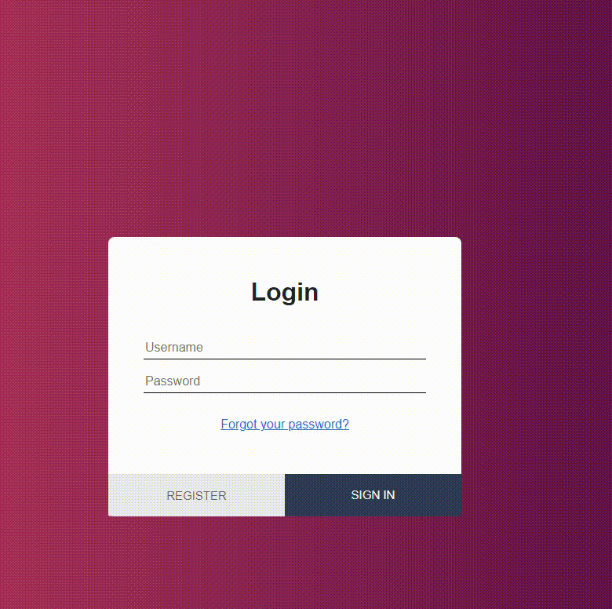
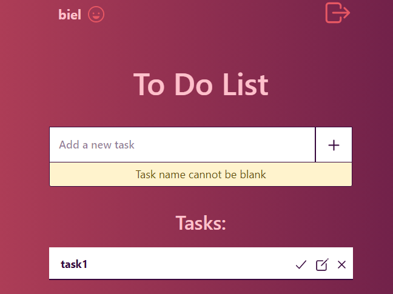
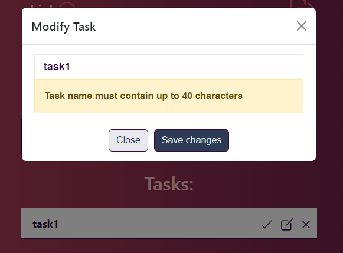
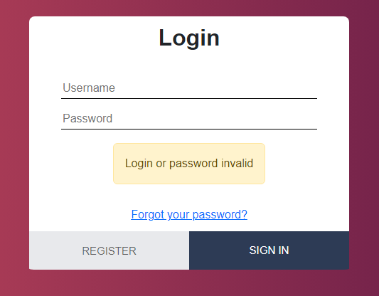
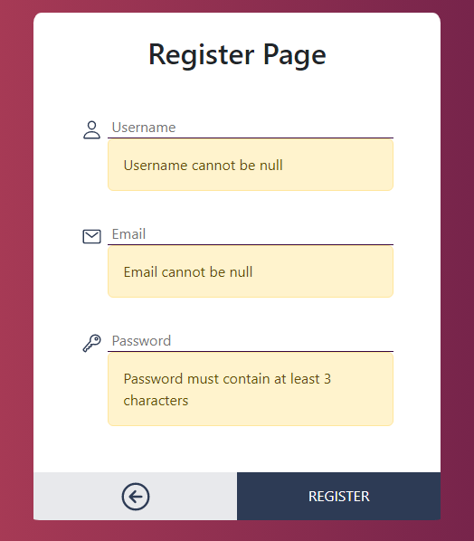

# To-do List application using Spring Boot + thymeleaf

## Project 💻

The objective of this project was to create a CRUD operation, using Spring Boot + Thymeleaf.

In context, here we have a "Task" management application. The user will be able to manipulate his own tasks in the system, performing the operations:

- `CREATE`
- `READ`
- `UPDATE`
- `DELETE`


<hr>
<br>

## How it works 

<p>The user will log into the application and create and manipulate its tasks</p>

<br>  



<br>
<br>


## Validation ✅

The most important validation is that a user can only handle his own tasks. Not being allowed to access data of other users.

<div class="validationImages">
    <div class="images1" style="margin-bottom:20px; display:flex; flex-direction:column">
        
        
        
        
    </div>
   
</div>


<hr>
<br>

## Technologies 


- [Java](https://www.oracle.com/java/technologies/downloads/)
- [Spring Boot](https://spring.io/projects/spring-boot)
- [Maven](https://maven.apache.org/download.cgi)
- [Thymeleaf](https://www.thymeleaf.org/)
- [Spring Data JPA](https://spring.io/projects/spring-data-jpa)
- [Spring Security](https://docs.spring.io/spring-security/reference/index.html)
- [PostgreSQL](https://www.postgresql.org/docs/)
- [HTML](https://developer.mozilla.org/en-US/docs/Web/HTML)
- [CSS](https://developer.mozilla.org/en-US/docs/Web/CSS)
- [JavaScript](https://developer.mozilla.org/pt-BR/docs/Web/JavaScript)


*To see how the application was built, click in on of the links above*

<hr>
<br>


## Configuration 🛠️ 

<h3> 
    Dependencies
    
</h3>

For the application to work correctly, it is important that it has the following dependencies:


- Spring Data JPA
- Spring Devtools
- Spring Web
- PostgreSQL Driver
- Spring Boot Starter Security
- Thymeleaf
- Bean Validation

💡 You will find them all on [mvn repository](https://mvnrepository.com/)


<br>


<h3> Aplication Properties ⚙️ </h3>

```properties
# Informamos o caminho do banco de dados
spring.datasource.url=jdbc:postgresql://localhost:5432/nomeDoBanco

# Usuário do banco de dados - São os usuários de dentro do banco de dados e NÃO do linux
spring.datasource.username=postgres

# Senha do banco de dados. É a senha do usuario de dentro do banco de dados
spring.datasource.password=123

# Acompanha as alterações feitas nas entidades. Qualquer alteração feita na entidade, a table também vai sofrer alteração.
spring.jpa.hibernate.ddl-auto=update

# Mostrar os commands SQL feitos pelo jpa
spring.jpa.show-sql=true
```


<hr>
<br>


<h2> Build and Run 🚀 </h2>

1. Clone the repository on your machine:

    ```bash
    //clone the repository
    git clone https://github.com/lGabrielDev/todo_list_java.git
    ```

2. Run the application and access the action [`http://localhost:8080/login`](http://localhost:8080/login)

<br>
